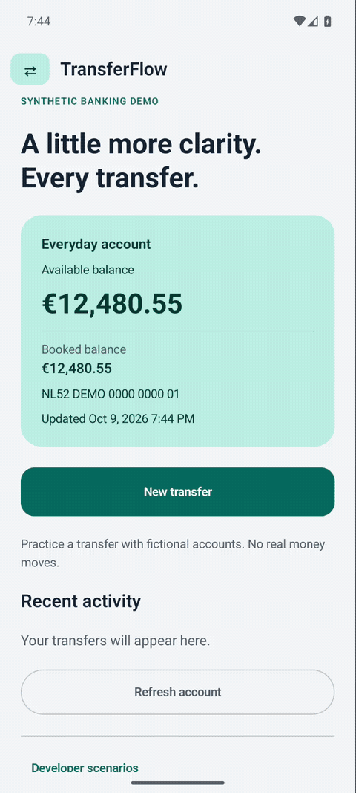
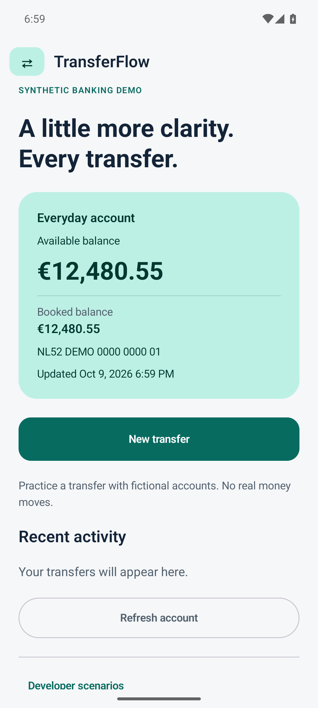
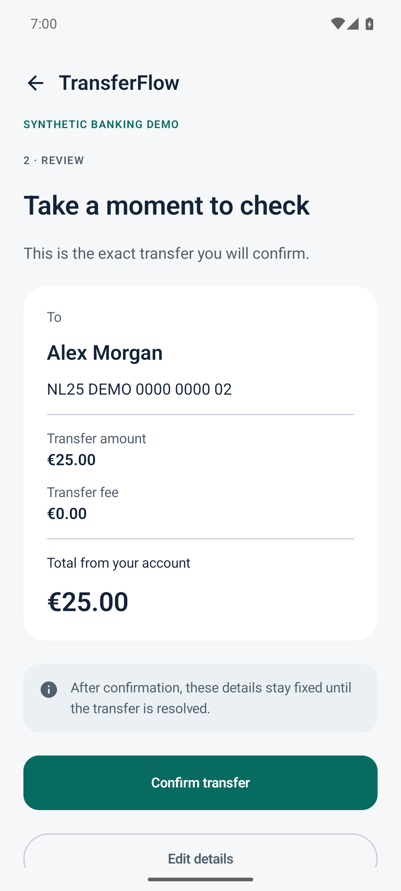
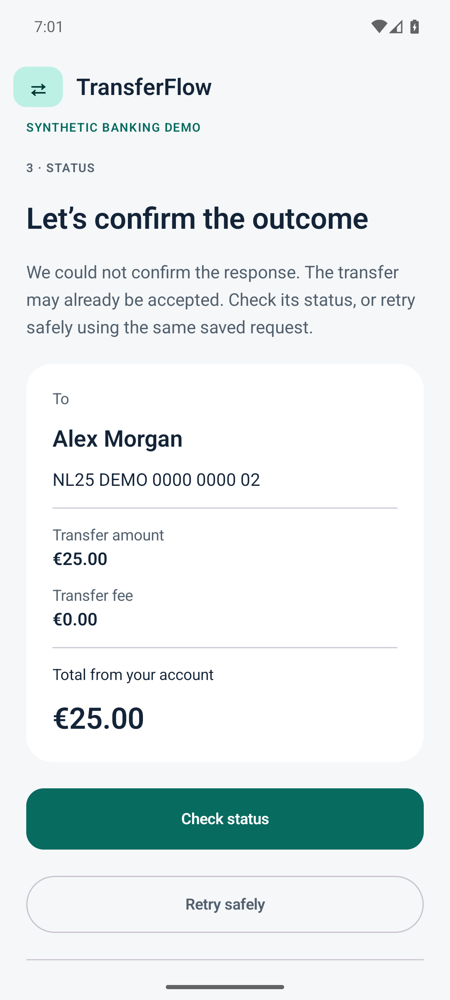

# TransferFlow

[](https://github.com/oudaykhaled/TransferFlow/actions/workflows/android.yml)

A native Android portfolio app that demonstrates a safe transfer journey using a synthetic bank. Kotlin, Jetpack Compose, MVVM and Room; three modules with explicit data ownership.

The central scenario is a timeout after the gateway accepts a transfer. The app keeps the original request, recovers its outcome after recreation, and replays safely without a second debit.

Start with the [two-minute reviewer walkthrough](docs/demo-guide.md), then inspect the [execution evidence](docs/verification.md).

Download an [installable synthetic demo with a SHA-256 checksum](docs/distribution.md) from a successful verification run, or build the source below. GitHub artifact downloads require sign-in and expire after 14 days.

## Watch recovery in the actual app

An 85-second emulator recording: review €25, lose the accepted response, cold-restart the app, then resolve the original transfer with **Retry safely**. Silent, normal speed; resized and converted to GIF without cuts. [Recording context and verification](docs/verification.md#recorded-reviewer-demo).



## Actual app captures

<p>
  
  
  
</p>

The [successful retry](docs/screenshots/success.png), [single history entry](docs/screenshots/account-after-retry.png), [dark theme](docs/screenshots/dark-account.png), and [200% text](docs/screenshots/large-text-dark.png) are emulator captures, not mockups.

## Run

Use Android Studio with Java 17, Android SDK platform 37.0 and build tools 36.0.0. Create an ignored local.properties containing your sdk.dir, then:

```sh
./gradlew :app:assembleDebug
./gradlew allJvmTests lintDebug
./gradlew :app:connectedDebugAndroidTest
```

The default demo works without a server, credentials or network connection. Debug controls select success, processing, rejection, timeout after acceptance and slow response, or simulate offline. Simulated offline blocks a fresh send; an already dispatched transfer retains its uncertain outcome.

## Architecture

| Module | Responsibility |
| --- | --- |
| core:domain | Exact EUR money, Dutch IBAN validation, immutable requests, transfer states and ports |
| core:data | Separate durable client journal/cache and synthetic gateway ledger; HTTP adapter |
| app | Lifecycle-aware ViewModel, Compose transfer journey and application wiring |

The client persists before transport. Payer-scoped idempotency keys bind to an immutable payload. A pending or uncertain request prevents a replacement. Gateway balance updates and operation acceptance are atomic; transaction history deduplicates by operation ID.

```mermaid
sequenceDiagram
    participant UI as Compose / ViewModel
    participant Client as Client Room journal
    participant Gateway as Synthetic gateway Room ledger
    UI->>Client: Persist immutable request and key
    Client->>Gateway: Submit original request
    Gateway->>Gateway: Accept and debit atomically
    Gateway--xClient: Response lost
    Client-->>UI: Outcome unknown; retain request
    Note over UI,Client: App can close and reopen here
    UI->>Client: Retry safely
    Client->>Gateway: Look up original key
    Gateway-->>Client: Original successful operation
    Client-->>UI: One operation, one history entry
```

Read the [ownership decision](docs/adr/0001-durable-transfer-ownership.md), [HTTP contract](docs/api/openapi.yaml), [dependency policy](docs/dependency-policy.md), and [verification evidence](docs/verification.md). Repository, gateway and UI tests sit beside their owning modules. The minified release compiles without the debug scenario controls.

## Why this follows Katty

[Katty](https://github.com/oudaykhaled/Katty) supplied a verified dependency matrix and lessons from repairing cache ownership, migration, lifecycle restoration and retries. TransferFlow uses three modules and explicit constructor injection to keep the banking failure modes easy to inspect. Its payment submission has its own idempotency rules.

## Boundaries

All account and recipient fixtures are synthetic. No real payments, bank login or personal customer data are used. The two local databases demonstrate ownership and recovery; they do not provide the security isolation of a remote bank. Clearing app data removes both. No production security certification or measured performance claim is made.
